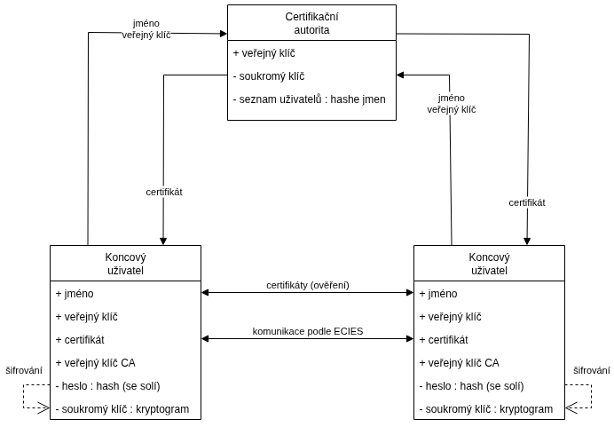
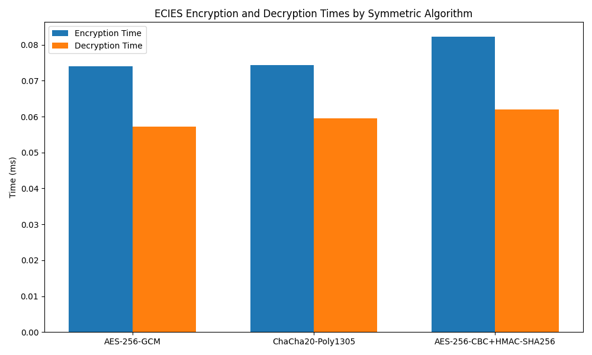

# Dokumentace ecApp projektu

---
**MPC-KRY 2026**

Zadání projektu: **Kryptografie nad eliptickými křivkami:**

Nastudujte principy kryptografie nad eliptickými křivkami, zejména algoritmy pro digitální podpis (ECDSA, EdDSA), ustanovení sdíleného tajného klíče (ECDH) a šifrovací schéma ECIES. Seznamte se s vlastnostmi moderních eliptických křivek a jejich bezpečnostní úrovní. Následně navrhněte a implementujte peer-to-peer aplikaci umožňující zabezpečenou komunikaci mezi dvěma účastníky přes veřejný nezabezpečený kanál.

Vypracovali: **Jurkovič, M.; Rylich, S.; Strouhal, D.; Szymutko, R.**

---


## 1. Úvod a účel aplikace

`ecApp` je komunikační aplikace založená na Pythonu, navržená pro bezpečnou peer-to-peer (P2P) komunikaci s využitím kryptografických funkcí eliptických křivek. Hlavním cílem aplikace je poskytnout uživatelům důvěrný, autentický a integritní komunikační kanál, kde jsou zprávy šifrovány a digitálně podepisovány. Řeší problém nechráněné komunikace přes nedůvěryhodné sítě tím, že implementuje moderní kryptografické protokoly pro zajištění soukromí a ověření identity.

Aplikace je rozdělena do několika klíčových modulů, které zajišťují generování klíčů, správu certifikátů, navazování P2P spojení, šifrování zpráv a jejich digitální podepisování.

## 2. Popis vstupů a výstupů

### Vstupy

*   **Uživatelské vstupy:**
    *   **Registrace:** Uživatelské jméno, heslo (pro ochranu privátních klíčů).
    *   **Přihlášení:** Uživatelské jméno, heslo (pro načtení a dešifrování privátních klíčů).
    *   **Chat:** Textové zprávy k odeslání.
    *   **Konfigurace:** IP adresa peeru pro navázání spojení.
*   **Soubory:**
    *   **CSR (Certificate Signing Request):** JSON soubor obsahující uživatelské jméno a Base64 kódované veřejné klíče (ECDSA a EdDSA), určený pro podepsání certifikační autoritou (CA).
    *   **Certifikáty:** JSON soubory (`ecdsa_cert.json`, `eddsa_cert.json`) obsahující podepsané veřejné klíče uživatele, vydané CA.
    *   **Privátní klíče:** Šifrované JSON soubory (`ecdsa_priv.json`, `eddsa_priv.json`) obsahující privátní klíče uživatele, chráněné heslem.
    *   **Hash hesla:** JSON soubor (`password.json`) obsahující hash uživatelského hesla.
    *   **Registry CA:** Šifrovaný JSON soubor (`registry.json`) obsahující seznam registrovaných uživatelů, spravovaný CA.
*   **Síťové vstupy:**
    *   Příchozí TCP spojení.
    *   Příchozí zprávy protokolu (HELLO, HELLO_ACK, MESSAGE, SIGN_ONLY, ERROR, BYE) ve formátu JSON s prefixem délky.

### Výstupy

*   **Uživatelské výstupy:**
    *   Potvrzení o úspěšné registraci, generování klíčů, uložení souborů.
    *   Zobrazení přijatých zpráv (šifrovaných a dešifrovaných, nebo podepsaných a ověřených).
    *   Chybové zprávy a systémová upozornění.
*   **Soubory:**
    *   **CSR soubory:** Vytvořeny během registrace.
    *   **Šifrované privátní klíče:** Uloženy v adresáři uživatele.
    *   **Hash hesla:** Uložen v adresáři uživatele.
    *   **Certifikáty:** Uloženy v adresáři uživatele po podepsání CA.
    *   **Registry CA:** Aktualizován a šifrovaně uložen CA.
*   **Síťové výstupy:**
    *   Odchozí TCP spojení.
    *   Odchozí zprávy protokolu (HELLO, HELLO_ACK, MESSAGE, SIGN_ONLY, ERROR, BYE) ve formátu JSON s prefixem délky.
    *   Šifrované ECIES balíčky a digitální podpisy.

## 3. Návod ke spuštění

### Technické požadavky

*   **Operační systém:** Jakýkoli OS podporující Python (Linux, Windows, macOS).
*   **Python:** Verze 3.8 nebo vyšší.
*   **Knihovny:** Viz `requirements.txt` (hlavní je `cryptography`).

### Instalace

1.  **Klonování repozitáře:**
    ```bash
    git clone https://github.com/240979/ecApp.git ecApp
    cd ecApp
    ```
2.  **Vytvoření a aktivace virtuálního prostředí:**
    ```bash
    python -m venv venv
    # Na Windows (PowerShell):
    .\venv\Scripts\activate.ps1
    # Na Linuxu/macOS:
    source venv/bin/activate
    ```
3.  **Instalace závislostí:**
    ```bash
    pip install -r requirements.txt
    ```

### Spuštění aplikace

Pro plné spuštění aplikace je nutné provést několik kroků, které zahrnují nastavení Certifikační Autority (CA), registraci uživatele a získání certifikátů.

1.  **Generování CA klíčů a hesla (jednorázově, provádí administrátor CA):**
    > Tento krok není třeba provádět pokud již máte k dispozici existující CA.

    Nejprve je nutné vygenerovat klíče pro Certifikační Autoritu a nastavit heslo pro správu CA.
    ```bash
    python config.py --generate-ca
    python config.py --generate-ca-admin-password
    ```
    Klíč i hash hesla musí být manuálně vložen do aplikace:
    * `ca/ca_keys/password.json` pro hash hesla
    * `config.py` konstanta `CA_PUBLIC_KEY_B64` pro veřejný klíč

2. **Spuštění hlavní aplikace:**
    ```bash
    python main_app.py
    ``` 
    1. **Registrace uživatele (každý uživatel):**
    Každý uživatel musí projít registračním procesem, který vygeneruje jeho klíče a vytvoří žádost o certifikát (CSR).
    Po registraci předá vygenerovaný `csr.json` soubor administrátorovi CA.

    2. **Podepsání CSR administrátorem CA:**
    Administrátor CA použije svůj privátní klíč k podepsání CSR a vydání certifikátů pro uživatele.
    Administrátor CA vám vrátí podepsané certifikáty (`ecdsa_cert.json`, `eddsa_cert.json`), které umístíte do vašeho adresáře `client/keys/<username>/`.
 
    3. **Nyní lze po přihlášení uživatele navazovat spojení.**

3. **Lokální debug**

    První instance aplikace:
    ``` bash
    python main_app.py --debug-local
    ```
    Druhá instance aplikace:
    ``` bash
    python main_app.py --debug-remote
    ```
    Takové spuštění zaručí odlišné porty pro obě strany v rámci jediného zařízení.

## 4. Bezpečnostní model

Bezpečnostní model `ecApp` je navržen tak, aby zajistil důvěrnost, integritu a autenticitu komunikace, stejně jako nepopiratelnost původu zpráv.

*   **Důvěrnost (Confidentiality):**
    *   Zprávy jsou šifrovány pomocí **ECIES (Elliptic Curve Integrated Encryption Scheme)**.
    *   ECIES využívá **efemérní klíče** pro každou zprávu, což zajišťuje **dopřednou bezpečnost (forward secrecy)** pro samotné zprávy. I kdyby byly dlouhodobé privátní klíče kompromitovány, staré zprávy zůstanou v bezpečí.
    *   Podporované symetrické šifrovací algoritmy v rámci ECIES jsou:
        *   **AES-256-GCM:** Režim s autentizovaným šifrováním, poskytuje důvěrnost i integritu.
        *   **ChaCha20-Poly1305:** Prouduvá šifra s autentizací, poskytuje důvěrnost i integritu.
        *   **AES-256-CBC+HMAC-SHA256:** Šifrování v režimu CBC s následným HMAC pro integritu (Encrypt-then-MAC).
    *   Privátní klíče uživatelů jsou uloženy šifrovaně na disku pomocí **AES-256-GCM**, chráněné heslem uživatele.

*   **Integrita (Integrity):**
    *   Všechny odesílané zprávy (šifrované i nešifrované v demo režimu) jsou digitálně podepsány.
    *   Pro šifrované zprávy se podpis vztahuje na celý **ECIES balíček** (ciphertext, nonce, salt atd.), nikoli na původní plaintext. To zabraňuje manipulaci s šifrovanou zprávou.
    *   Použité algoritmy pro digitální podpisy:
        *   **EdDSA (Ed25519):** Moderní, efektivní a bezpečný podpisový algoritmus.
        *   **ECDSA (P-256, SHA-256):** Standardní podpisový algoritmus eliptických křivek.
    *   Autentizované šifrovací režimy (AES-GCM, ChaCha20-Poly1305) a HMAC (pro AES-CBC) zajišťují integritu šifrovaných dat.

*   **Autenticita (Authenticity):**
    *   **Autenticita peerů:** Zajištěna pomocí **digitálních certifikátů** vydaných centrální **Certifikační Autorita (CA)**. Během handshake si peerové vyměňují své certifikáty, které jsou ověřeny proti veřejnému klíči CA. Tím je zajištěno, že komunikujete s ověřeným uživatelem.
    *   **Autenticita zpráv:** Zajištěna digitálními podpisy. Příjemce ověří podpis zprávy pomocí veřejného klíče odesílatele (získaného z jeho certifikátu).
    *   **Autenticita uživatele:** Při spuštění aplikace se uživatel autentizuje heslem, které dešifruje jeho privátní klíče.
    *   **Ochrana hesla:** Pro hashování hesel je použit algoritmus **Argon2id** s parametry doporučenými OWASP: 19 MiB paměti, 2 iterace, 1 vlákno.
*   **Nepopiratelnost (Non-repudiation):**
    *   Digitální podpisy zajišťují, že odesílatel nemůže popřít odeslání zprávy, pokud je jeho privátní klíč v bezpečí.

*   **Správa klíčů:**
    *   **CA:** Centrální entita, která podepisuje veřejné klíče uživatelů a vydává jim certifikáty. CA má svůj vlastní pár klíčů (ECDSA P-256), přičemž privátní klíč CA je chráněn heslem administrátora CA.
    *   **Derivace klíčů:** Pro odvození symetrických klíčů z ECDH sdíleného tajemství se používá **HKDF-SHA256** se solí a kontextovou informací, což zvyšuje bezpečnost.

## 5. Architektura řešení

Aplikace `ecApp` je modulární a skládá se z několika hlavních komponent, které spolupracují na zajištění bezpečné komunikace. Následující diagram znázorňuje základní strukturu a interakce mezi hlavními moduly:



### Popis hlavních komponent:
*   **`main_app.py`:** Vstupní bod aplikace. Zpracovává argumenty příkazové řádky, načítá uživatelské klíče a certifikáty, a inicializuje chatovací aplikaci.
*   **`app/app.py`:** Obsahuje hlavní logiku chatovací aplikace. Zajišťuje handshake mezi peery, správu šifrovacích algoritmů, odesílání a příjem zpráv, jejich šifrování/dešifrování a podepisování/ověřování. Spravuje vlákna pro příjem zpráv.
*   **`register.py`:** Utility pro registraci nového uživatele. Generuje páry klíčů (ECDSA a EdDSA), šifrovaně ukládá privátní klíče a vytváří CSR soubor pro CA.
*   **`ca_sign.py`:** Utility pro administrátora Certifikační Autority (CA). Načítá privátní klíč CA, ověřuje CSR, podepisuje uživatelské veřejné klíče a vydává certifikáty. Spravuje šifrovaný registr registrovaných uživatelů.
*   **`config.py`:** Obsahuje globální konfiguraci, jako jsou cesty k adresářům klíčů, podporované algoritmy a funkce pro generování klíčů CA a hash hesla administrátora CA.
*   **`crypto/`:** (adresář)
    *   **`keys.py`:** Funkce pro generování, ukládání a načítání ECDSA a EdDSA klíčů, konverzi klíčů do/z Base64, a funkce pro hashování/ověřování hesel.
    *   **`ecies.py`:** Implementace ECIES pro šifrování a dešifrování zpráv. Zahrnuje ECDH pro sdílené tajemství, HKDF pro derivaci klíčů a podporu pro AES-GCM, ChaCha20-Poly1305 a AES-CBC+HMAC.
    *   **`signing.py`:** Funkce pro digitální podepisování a ověřování zpráv pomocí ECDSA a EdDSA.
    *   **`certificates.py`:** Funkce pro vytváření, ukládání, načítání a ověřování digitálních certifikátů.
*   **`network/peer.py`:** Modul pro správu P2P síťového spojení. Zajišťuje navázání TCP spojení, ať už jako iniciátor nebo posluchač, a to i v debugovacích režimech.
*   **`protocols/protocol.py`:** Definuje komunikační protokol aplikace. Zahrnuje strukturu zpráv (JSON), typy zpráv (HELLO, MESSAGE, BYE atd.) a mechanismus rámování zpráv (prefix délky) pro spolehlivý přenos přes TCP.
*   **`utils/logger.py`:** Jednoduchý logovací modul pro záznam kryptografických operací a událostí.

## 6. Použité kryptografické mechanismy

`ecApp` intenzivně využívá knihovnu `cryptography` pro implementaci robustních kryptografických mechanismů.

*   **Generování Klíčů:**
    *   **ECDSA P-256:** Pro generování párů klíčů eliptických křivek (secp256r1) používaných pro ECIES (šifrování) a ECDSA podpisy.
        *   `generate_ecdsa_keypair()` v `crypto/keys.py`
    *   **EdDSA Ed25519:** Pro generování párů klíčů EdDSA, používaných pro EdDSA podpisy.
        *   `generate_eddsa_keypair()` v `crypto/keys.py`

*   **Derivace Klíčů:**
    *   **HKDF-SHA256 (HMAC-based Key Derivation Function):** Používá se k bezpečnému odvození symetrických šifrovacích klíčů z ECDH sdíleného tajemství. Zajišťuje, že sdílené tajemství není přímo použito jako klíč a přidává odolnost proti útokům. Využívá sůl (`salt`) a kontextovou informaci (`info`).
        *   `derive_symmetric_key()` v `crypto/ecies.py`
    *   **PBKDF2:** Pro derivaci klíčů z uživatelského hesla k šifrování privátních klíčů a ověřování hesla.
    *   **Argon2id:** Pro derivaci klíčů z uživatelského hesla k šifrování privátních klíčů a ověřování hesla. Používá se funkce `derive_key_from_password()` v `crypto/keys.py` (také pro dešifrování registru CA) a `hash_password()` a `verify_password()` pro uživatelská hesla. Parametry Argon2id jsou nastaveny na 19 MiB paměti, 2 iterace a 1 vlákno, což odpovídá doporučením OWASP.

    
*   **Šifrování (ECIES - Elliptic Curve Integrated Encryption Scheme):**
    *   **ECDH (Elliptic Curve Diffie-Hellman):** Pro výměnu klíčů a vytvoření sdíleného tajemství mezi dvěma peery. Každá ECIES operace generuje efemérní pár klíčů pro zajištění dopředné bezpečnosti.
        *   `ecdh_shared_secret()` v `crypto/ecies.py`
    *   **Symetrické šifrování:**
        *   **AES-256-GCM:** Autentizované šifrování s asociovanými daty (AEAD). Poskytuje důvěrnost, integritu a autenticitu. Používá 12-bajtový nonce.
            *   `_encrypt_aes_gcm()`, `_decrypt_aes_gcm()` v `crypto/ecies.py`
        *   **ChaCha20-Poly1305:** Proudová šifra s autentizací (AEAD). Poskytuje důvěrnost, integritu a autenticitu. Používá 12-bajtový nonce.
            *   `_encrypt_chacha20()`, `_decrypt_chacha20()` v `crypto/ecies.py`
        *   **AES-256-CBC + HMAC-SHA256:** Šifrování v režimu Cipher Block Chaining (CBC) pro důvěrnost, kombinované s HMAC-SHA256 pro integritu a autenticitu (Encrypt-then-MAC). Klíč je rozdělen na šifrovací a MAC klíč. Používá 16-bajtový IV.
            *   `_encrypt_aes_cbc_hmac()`, `_decrypt_aes_cbc_hmac()` v `crypto/ecies.py`

*   **Digitální Podpisy:**
    *   **ECDSA (P-256, SHA-256):** Používá se pro podepisování dat s hashovací funkcí SHA-256.
        *   `ecdsa_sign()`, `ecdsa_verify()` v `crypto/signing.py`
    *   **EdDSA (Ed25519):** Používá se pro podepisování dat.
        *   `eddsa_sign()`, `eddsa_verify()` v `crypto/signing.py`

*   **Certifikáty:**
    *   Jednoduchá JSON struktura obsahující uživatelské jméno, veřejný klíč a podpis CA.
    *   **Ověření certifikátu:** Provádí se ověřením digitálního podpisu CA na certifikátu pomocí veřejného klíče CA.
        *   `create_certificate()`, `verify_certificate()` v `crypto/certificates.py`

    * Struktura certifikátu (JSON):
```json
    {
    "issuer":             "CA",
    "publicKey":          "<base64 DER public key>",
    "publicKeyAlgorithm": "Ed25519" | "ECDSA-P256",
    "signature":          "<base64 CA signature>"
    "subject":            "<username>"
    }
```

## 7. Testovací metodika a výsledky

Aplikace obsahuje integrované jednotkové a integrační testy, které jsou spouštěny pomocí argumentu `--test` u příslušných skriptů. Tyto testy pokrývají klíčové kryptografické operace a síťovou komunikaci.

### Testovací metodika

Každý modul s kritickou funkcionalitou (např. `register.py`, `ca_sign.py`, `signing.py`, `ecies.py`, `protocol.py`, `peer.py`) obsahuje funkci `_selftest()`, která:

1.  **Nastaví testovací prostředí:** Vytvoří dočasné soubory a adresáře, generuje testovací klíče a data.
2.  **Provede operace:** Simuluje reálné scénáře použití (např. generování klíčů, šifrování, podepisování, navazování spojení).
3.  **Ověří výsledky:** Používá `assert` tvrzení k ověření správnosti provedených operací (např. dešifrovaná zpráva se rovná původní, podpis je platný, spojení je navázáno).
4.  **Testuje chybové stavy:** Pokouší se vyvolat očekávané chyby (např. dešifrování s nesprávným klíčem, ověření padělaného podpisu).
5.  **Vyčistí prostředí:** Odstraní dočasné soubory.

### Pokryté oblasti testů

*   **`register.py`:** Generování a ukládání klíčů, hashování hesla, tvorba CSR.
*   **`ca_sign.py`:** Načítání klíčů CA, správa registru uživatelů, podepisování CSR, ověřování certifikátů.
*   **`signing.py`:** ECDSA a EdDSA podepisování a ověřování, testování platných/neplatných podpisů a zpráv.
*   **`ecies.py`:** ECIES šifrování a dešifrování pro všechny podporované symetrické algoritmy (AES-GCM, ChaCha20-Poly1305, AES-CBC+HMAC), testování s nesprávnými klíči a padělanými daty.
*   **`protocol.py`:** Serializace a deserializace zpráv, rámování zpráv (prefix délky), odesílání a příjem zpráv přes socket.
*   **`network/peer.py`:** Navazování P2P spojení v různých režimech (iniciátor, posluchač, debugovací režimy).

### Výsledky testů

Všechny integrované testy jsou navrženy tak, aby při úspěšném průběhu vypisovaly zprávy jako "Valid signature accepted", "Encryption and decryption successful", "All checks passed." a podobně. Selhání testu vede k vyvolání výjimky `AssertionError` nebo jiné chyby, která indikuje problém.

Při běžném vývoji a testování byly všechny tyto testy úspěšné, což naznačuje základní funkčnost a správnou implementaci kryptografických primitiv a síťové logiky.

### Interaktivní testovací sada (`tester.py`)

Kromě integrovaných `_selftest()` funkcí projekt obsahuje komplexní interaktivní testovací sadu (`tester.py`). Tato sada umožňuje:

*   **Výkonnostní benchmarky:** Měří časy provádění pro generování klíčů, podepisování, ověřování a šifrování/dešifrování napříč algoritmy ECDSA, EdDSA a ECIES.
*   **Bezpečnostní validace:** Simuluje útoky v paměti (např. bit-flipping, falšování podpisů a spoofing identity), aby se zajistilo, že kontroly integrity a AEAD backendy správně odmítají neplatná nebo pozměněná data.
*   **Síťová simulace:** Spouští lokální test smyčky klient-server, ideální pro inspekci pomocí Wiresharku, aby vizuálně demonstroval rozdíl mezi komunikací v prostém textu a šifrovaným provozem ECIES po síti.

Spuštění interaktivního testovacího rozhraní:
```bash
python -m tester.tester
```
Nebo pro spuštění s **grafickým zobrazením výsledků**:
```bash
python -m tester.tester --plot
```

Tyto testy poskytují hlubší pohled na chování aplikace v různých scénářích a ověřují její odolnost proti běžným útokům a správnou funkčnost kryptografických operací.

#### Demonstrace selhání bezpečnosti

```diff
! --- 1. ECDSA Signatures (SECP256R1) ---
[Test 1.1] Altering one byte in ECDSA signature (Data-in-transit modification)
SUCCESS: ecdsa_verify returned False. Tampered ECDSA signature was rejected.
- [INFO] ✗ TAMPER — ECDSA signature byte flipped
[Test 1.2] Verifying valid ECDSA signature with a different public key (Identity spoofing)
SUCCESS: ecdsa_verify returned False. Eva's key cannot verify Alice's ECDSA signature.
- [INFO] ✗ AUTH_FAIL — Wrong public key used for ECDSA verify

! --- 2. EdDSA Signatures (Ed25519) ---
[Test 2.1] Altering one byte in EdDSA signature (Data-in-transit modification)
SUCCESS: eddsa_verify returned False. Tampered signature was rejected.
- [INFO] ✗ TAMPER — EdDSA signature byte flipped
[Test 2.2] Verifying valid EdDSA signature with a different public key (Identity spoofing)
SUCCESS: eddsa_verify returned False. Eva's key cannot verify Alice's signature.
- [INFO] ✗ TAMPER — EdDSA signature byte flipped

! --- 3. ECIES Encryption (AEAD Integrity) ---
[Test 3.1] Modifying ECIES ciphertext in memory
SUCCESS: ECIES decryption failed as expected! Caught exception: InvalidTag
- [INFO] ✗ DECRYPT [AES-256-GCM] 63B
```
#### Simulace síťové komunikace
```diff
[INFO] ✓ KEY_GEN [ECDSA-P256]
[INFO] ✓ KEY_GEN [Ed25519]
[Server] Listening on 127.0.0.1:25519...
[Client] Connecting to 127.0.0.1:25519...
[Server] Connection established with ('127.0.0.1', 43216)

![Client] Sending unencrypted message...
[Server] Received Message 1 (Unencrypted):
         Type: SIGN_ONLY
         Plaintext: Hello Bob! This is in PLAINTEXT. You can read me in Wireshark!

![Client] Sending ENCRYPTED message...
[Server] Received Message 2 (Encrypted):
         Type: MESSAGE
        -> Successfully decrypted: Secret launch codes: 12345. Wireshark cannot see this!
> [INFO] ✓ DECRYPT [ECIES] 54B

![Client] Sending ENCRYPTED but TAMPERED message...
[Server] Received Message 3 (ECIES Encrypted, Tampered in transit):
[INFO] ✗ TAMPER — ECIES ciphertext authentication failed
         Attempting ECIES decryption...
         -> SUCCESS (Expected Error): Decryption failed! Cryptography exception caught: 
- [INFO] ✗ TAMPER — ECIES ciphertext authentication failed

[Server] Connection closed.
[Client] Done.

```

#### Srovnání algoritmů
<table>
  <thead>
    <tr>
      <th></th>
      <th>ECDSA<br>(Křivka SECP256R1)</th>
      <th>EdDSA<br>(Křivka Ed25519)</th>
    </tr>
  </thead>
  <tbody>
    <tr>
      <td><strong>Velikost veřejného klíče [byte]</strong></td>
      <td>91</td>
      <td>44</td>
    </tr>
    <tr>
      <td><strong>Velikost podpisu [byte]</strong></td>
      <td>70</td>
      <td>64</td>
    </tr>
    <tr>
      <td><strong>Prům. čas generování klíče [ms]</strong></td>
      <td>0,013</td>
      <td>0,026</td>
    </tr>
    <tr>
      <td><strong>Prům. čas podepisování [ms]</strong></td>
      <td>0,019</td>
      <td>0,025</td>
    </tr>
    <tr>
      <td><strong>Prům. čas ověření [ms]</strong></td>
      <td>0,049</td>
      <td>0,080</td>
    </tr>
  </tbody>
</table>



### Logování a audit

Modul `utils/logger.py` zaznamenává všechny důležité kryptografické operace a bezpečnostní události (jako je generování klíčů, ověřování certifikátů, šifrování, dešifrování, selhání autentizace a detekce manipulace). Logy mohou být volitelně šifrovány pomocí AES-256-GCM, což zajišťuje jejich důvěrnost i v případě kompromitace systému. To umožňuje auditování a forenzní analýzu.


## 8. Seznam použitých knihoven a zdrojů

### Python standardní knihovny

*   `socket`: Pro síťovou komunikaci (TCP/IP).
*   `threading`: Pro paralelní zpracování (např. vlákno pro příjem zpráv).
*   `json`: Pro serializaci a deserializaci dat do/z formátu JSON.
*   `os`: Pro interakci s operačním systémem (cesty k souborům, vytváření adresářů).
*   `sys`: Pro systémové operace (argumenty příkazové řádky, ukončení skriptu).
*   `getpass`: Pro bezpečné zadávání hesla bez zobrazení na konzoli.
*   `base64`: Pro kódování a dekódování binárních dat do/z Base64.
*   `argparse`: Pro parsování argumentů příkazové řádky.
*   `hmac`: Pro implementaci HMAC (Hash-based Message Authentication Code).
*   `hashlib`: Pro hashovací funkce (např. SHA256).
*   `struct`: Pro práci s binárními daty (např. prefix délky zpráv).
*   `time`: Pro časové operace (např. zpoždění v síťových operacích).

### Externí knihovny

*   **`cryptography`**: Hlavní kryptografická knihovna. Poskytuje implementace pro:
    *   Eliptické křivky (ECDSA, EdDSA, ECDH).
    *   Symetrické šifry (AES, ChaCha20).
    *   Režimy šifrování (GCM, CBC, Poly1305).
    *   Funkce pro derivaci klíčů (HKDF, PBKDF2).
    *   Hashovací funkce.
    *   Zabezpečené generování náhodných čísel (`os.urandom`).
*   **`argon2-cffi`**: Implementace algoritmu pro hashování hesel Argon2id.
    *   Bezpečné ukládání hashů uživatelských hesel (`password.json`) a pro ověřování hesel.
    *   Parametry Argon2id jsou nastaveny podle doporučení OWASP.
*   **`python-dotenv`**: Načítání proměnných prostředí ze souboru `.env`.
    *   Umožňuje volitelné nastavení `LOG_SEC_KEY` pro automatické šifrování logů.
*   **`matplotlib`**: Generování grafických vizualizací.
    *   Využívána v `tester.py` pro vizualizaci výsledků výkonnostních benchmarků (generování klíčů, podepisování, ověřování, šifrování/dešifrování) napříč algoritmy.


### Zdroje

*   Dokumentace knihovny `cryptography`: https://cryptography.io/en/latest/
*   RFC 5869: HMAC-based Extract-and-Expand Key Derivation Function (HKDF)
*   Standardy pro eliptické křivky (např. NIST SP 800-186 pro P-256).
*   Standardy pro EdDSA (RFC 8032).
*   Doporučení OWASP pro parametry Argon2id.
*   Obecné principy síťové komunikace a TCP/IP.
*   Principy P2P sítí.
*   Principy Certificate Authorities a PKI.
*   Principy ECIES.
*   Principy autentizovaného šifrování (AEAD).

## 9. Diskuse omezení řešení a možná rozšíření

### Omezení řešení

1.  **Centralizovaná Certifikační Autorita (CA):** Současné řešení spoléhá na jedinou CA. To představuje **jediný bod selhání a důvěry**. Kompromitace privátního klíče CA by vedla k možnosti vydávání falešných certifikátů a narušení celého bezpečnostního modelu.
2.  **Žádný mechanismus odvolání certifikátů:** Aplikace neimplementuje mechanismy pro odvolání kompromitovaných certifikátů (např. CRL - Certificate Revocation Lists nebo OCSP - Online Certificate Status Protocol). Pokud je privátní klíč uživatele kompromitován, jeho certifikát zůstává platný, dokud jej CA administrátor ručně neodstraní z registru.
3.  **Žádná dopředná bezpečnost pro identitní klíče:** Zatímco ECIES poskytuje dopřednou bezpečnost pro zprávy, dlouhodobé identitní klíče (ECDSA a EdDSA) uživatelů nejsou rotovány. Kompromitace těchto klíčů by mohla umožnit padělání podpisů a dešifrování budoucích zpráv, pokud by nebyly použity efemérní klíče.
4.  **Pouze přímá P2P komunikace:** Aplikace podporuje pouze přímé P2P spojení, což může být problematické v sítích s NAT (Network Address Translation) nebo firewally, které blokují příchozí spojení. Nejsou implementovány techniky pro průchod NAT (např. STUN, TURN, ICE).
5.  **Žádné asynchronní zprávy:** Uživatelé musí být online současně, aby si mohli vyměňovat zprávy. Neexistuje mechanismus pro ukládání a doručování zpráv offline uživatelům.
6.  **Pouze textová konzolová aplikace:** Chybí grafické uživatelské rozhraní (GUI), což omezuje použitelnost pro běžné uživatele.
7.  **Žádná skupinová komunikace:** Aplikace je navržena pouze pro komunikaci mezi dvěma peery.
8.  **Omezené logování a monitorování:** Logování je základní a nemusí být dostatečné pro forenzní analýzu nebo detekci pokročilých útoků.

### Možná rozšíření

1.  **Decentralizovaná CA nebo Web-of-Trust:** Nahradit centralizovanou CA distribuovaným modelem (např. blockchain-based PKI, nebo model důvěry jako PGP), který by eliminoval jediný bod selhání.
2.  **Implementace mechanismů odvolání certifikátů:** Přidat podporu pro CRL nebo OCSP pro efektivní správu odvolaných certifikátů.
3.  **Rotace identitních klíčů:** Pravidelná rotace dlouhodobých identitních klíčů by zvýšila celkovou bezpečnost a odolnost proti kompromitaci.
4.  **NAT Traversal:** Implementace protokolů jako STUN, TURN nebo ICE pro umožnění P2P spojení i za NAT a firewally.
5.  **Asynchronní zprávy a offline doručování:** Zavedení serveru pro ukládání zpráv, který by držel zprávy pro offline uživatele a doručoval je po jejich připojení. To by vyžadovalo další bezpečnostní opatření pro ochranu zpráv na serveru.
6.  **Grafické uživatelské rozhraní (GUI):** Vytvoření uživatelsky přívětivého rozhraní pomocí knihoven jako PyQt, Kivy nebo Tkinter.
7.  **Skupinová komunikace:** Rozšíření protokolu a kryptografických mechanismů pro podporu bezpečných skupinových chatů.
8.  **Vylepšené logování a auditování:** Implementace podrobnějšího logování s možností konfigurace úrovní logování a exportu pro analýzu.
9.  **Podpora pro další kryptografické algoritmy:** Rozšíření o další moderní algoritmy nebo post-kvantové kryptografické algoritmy.
10. **Metadata Protection:** Současné řešení nechrání metadata komunikace (kdo s kým komunikuje, kdy). Rozšíření by mohlo zahrnovat techniky pro anonymizaci nebo ochranu metadat.

---
